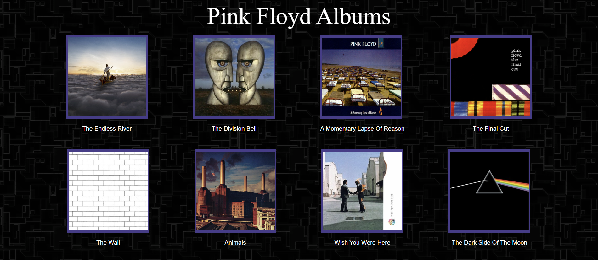
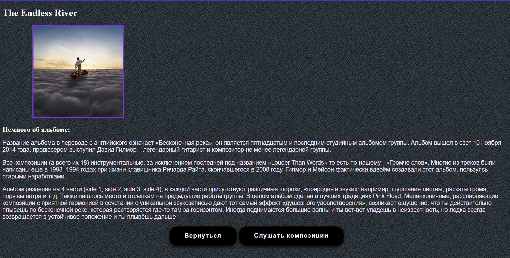
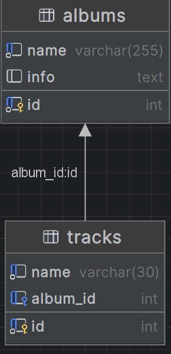

# pinkFloyd
## Архитектура
### Сайт написан на языке Java с использованием модулей фреймоврка Spring, таких как Spring Boot и Spring MVC  
### В качестве базы данных выступает реляционная MySQL, fronted простенький (HTML + CSS, никакого node-js)
## Главная страница

## Информация об альбоме

## Композиции альбома

## Структура базы данных

